Written Standard Operating Procedures (SOP) rarely describe a process in enough detail to reproduce it exactly. Humans and agents fill the gaps, which creates unexpected behavior, especially where verification is weak, as in regulation. In this post we define a regulatory standard procedure, and use continual learning to help a learning agent recover parts of it from an incomplete state.

In six runs the learner recovered routing rules within one rewrite (two of the three to 100%), counting conventions only when it could reason before answering, and sentence rules to 98% acceptance. It also reduced the SOP word count by 43% with a modest performance loss (8 points of exact match) using a non-linear length penalty.

This post was written with the help of Claude Fable 5.1.

## Business problem, data, and learning loop

### The RegTriage problem

A company's compliance team reads Federal Register documents and decides whether each applies to the company, what obligation it creates, and what to do depending on the situation. An analyst follows a standard operating procedure (SOP); a senior reviewer corrects the records. The reviewer's corrections are the only training signal, and the procedure is what should improve. The benchmark reproduces this for Acme Pay, a fictional payments fintech with a bank charter.

### Data

37,073 real documents from four CFR titles and nine financial agencies, 2016-09 to 2026-09. The build derives the company's register and gold records. Splits are chronological: train 17,897 documents, test 11,160, and dev 50 carved out of train, stratified so each hidden rule fires on 10 documents. 305 documents are dropped where the rendered page and the structured fields disagree, so the grader never uses a fact the agent could not read.

### Architecture





### SOP and rules

`sop/v0.md` states three rules: relevance (a watched CFR part or agency), class (from the SECTION line), and register action (from the class). The oracle applies three more rules. **H1**: a correction links to the entry it corrects. **H2**: a document whose RIN is already tracked is an update. **H3**: a rule still open for comment is a monitor. `sop/v_oracle.md` is the full SOP: it states every rule and is scored at the end of each run as the reference.

Both files are procedures an analyst can follow top to bottom. The initial `v0.md` is 243 words in four steps: decide relevance from the company profile, classify by the SECTION line, set the register action from the class with a null target, submit. The oracle file is the same text plus three steps between classification and submit: Step 4 decides whether the document is a correction (the ACTION line or title says so, or the document number starts with `C1-`) and links it to the entry it corrects, or leaves the target null when there is none; Step 5 calls `query_register` with each RIN and turns a tracked rulemaking into an `update`; Step 6 turns a rule whose DATES text still invites comment into a `monitor`. Those three steps are what "hidden" means: the agent is graded on them and never reads them.



### Judge and oracle

The oracle is deterministic python code: it computes the gold record from the structured fields. The judge compares the agent's record against gold and writes the reviewer's note in one of three modes, drawn per episode: a reject with a case-specific reason (40%), a silent correction returning the fixed record (40%), or a terse reject naming the wrong fields (20%).



The judge names the fault before it writes. It diffs the scored fields, then maps the differences to seven kinds of discrepancy, most specific first: a missed correction, a false correction, a missed update, a missed comment period, a wrong target, a wrong label, wrong counts. A silent correction returns the gold record without the obligation sentence, and a terse reject lists the field names.

### Regulatory Agent

`claude-sonnet-5`, medium effort, four read-only tools (document, company profile, register, submit), max 20 tool calls per episode. It receives the SOP as its system prompt and nothing about the hidden rules.

### Learner

`claude-opus-5`. It reads the current SOP, the agent outputs and the judge and oracle feedback. It never reads the gold record, the rule names, or the metrics. It answers with up to five line edits, which the loop applies to write the next SOP version. What it writes is a forced call to one tool, `propose_edits`, whose items are `replace`, `insert_after` or `delete` on the original line numbers, each with a one-sentence reason and the episode ids that support it. The loop applies them in order, writes `v{n+1}.md`, and records the edits, their weights and the cost.



The result of that first rewrite in run 01: three edits, 243 words to 436, and exact match from 44% to 88% on the next scoring.

### Metrics

Every run reports three numbers, all on the dev split of 50 documents, from `run.score`:

- **Exact match**: the share of episodes where all computable fields match gold and, where H5 is on, the sentence was accepted. One wrong field makes the episode wrong. This is the number to read first.
- **Field accuracy**: partial credit, the share of fields that match over the 50 episodes. Where H5 is on, the expert's verdict on the sentence counts as an eighth field.
- **Per-rule accuracy**: for H1, H2 and H3, on the 10 dev documents where that rule fires, the share with the four label fields right. For H4, all three counts right. For H5, the sentence accepted.

### Initial loop

Four rounds. Each evaluates the current SOP on dev, runs it on a rotating slice of 50 train documents, and hands those notes to the learner, which writes the next version. The run ends by scoring v4 and the full SOP on dev.

### Initial results

Run 01 uses the three rules above. Exact match goes from 44% to 92% in four rounds (94% at v2). H2 and H3 reach 100% at the first rewrite. H1 stays at 60–70%: the failures are corrections with no entry to link to, which the reviewer's note describes as if one existed (@tbl-t1).



The learner's v4 SOP recovers the three rules as overrides on the classification step and a lookup on the register step; it is longer than the oracle's version because it also carries the exceptions single reviewers asked for.



## Increasing complexity and regularization

Since the hidden SOP rules were relatively easy to learn, we expanded on two different avenues, making new harder tasks and adding constraints to the learning process.





`v0.md` grows to 311 words with two stated tasks, count the regulation text and write one sentence, and still says nothing about how to count or what a right sentence is; `v_oracle.md` grows to 970 words and states both.



### A deterministic rule the agent must compute using python (H4)

#### Description

The SOP asks for three metrics based on document text. Given LLM tokenization, to successfully perform this task the model is asked to write a simple python script and run it with a `run_python` tool. The incomplete SOP does not say how to do it. H4 fires on every relevant document, so it has its own score and stays out of the H1–H3 accuracies.

The convention is six lines of `oracle.py`, counted over exactly the text `get_document` returns:



#### Failure

With the counts task activated, v0 scored 0% in the first runs, before the feedback filter, and 20% exact in every run in the tables. In run 02 the learner takes the routing rules to 90 / 100 / 100 and exact match does not move. A vicious circle occurred: the learner drowned on word counting feedback, 40 of its 50 notes rejected the counts, and it wasn't able to propose successful edits to improve word counting.

#### Thinking turn

After the initial failure, two decisions were made, one to limit the amount of edits targeted to specific rules, and two to add an additional thinking step. Both decisions will be explored more deeply in the discussion section. For now, since the learner's first call was a forced `propose_edits`, we add a switch, `--thinking`, which makes that turn unforced at 16,000 tokens instead of 8,000.

#### Results

The run's result is set by its first counting edit. Run 03 wrote `re.findall(r"[A-Za-z]+", text)` in its first rewrite: counts right went to 100% at v1 and stayed there, and exact match went 20, 90, 92, 98, 100, equal to the full SOP's score. @tbl-t3 shows what each learner settled on.



The counting step as written, wrong and right:



### A rule a model grades (H5)

#### Description

The record gains one field, a sentence: what Acme Pay must do. There is no deterministic gold sentence. An expert (`claude-opus-5` holding the full procedure) reads each one and gives a binary answer. The failure reason, one of six categories, is withheld. The learner may call `ask_oracle` for one episode and get the category, at a price of one wrong answer against that round, up to five per round.



The six categories are `obligation_missing`, `not_an_obligation` (describes the document instead of stating a duty), `wrong_party`, `overbroad`, `missing_condition` and `unsupported`. `ask_oracle` is the only way the learner can read them, and the tool description tells the learner the price: "Costs this round one wrong answer on its score, whether or not the answer turns out to be useful."

#### Results

Run 04's sentence accuracy went 40, 62, 84, 98, 98 across v0 to v4. It bought 3 questions of a possible 20. The learned v3 scores 96% exact against the full SOP's 86%, which means that the resulting description is equal or better than the pre-written full SOP description.

The learner spent 10 of its 60 questions across the three runs, never more than two in a round, and each answer appears in the edit the learner wrote next. All three runs asked their first question about the same episode, 2018-25398, and got the same answer, `overbroad`. @tbl-t5 shows run 04's three questions beside the sentence edit it wrote in the same rewrite.



The sentence step, before and after learning, beside the rubric the expert holds:



### A length penalty on the procedure

#### Description

Exact match alone rewards a longer procedure. The length penalty subtracts `k · growth²`, growth being the proposed SOP's words over the baseline of 311, minus one. The learner is told what its length costs and what the next 50 words would cost. Run 06 uses k = 0.08.

The change is two functions in `run.py` and one paragraph in the learner's prompt. `length_growth = max(0, words / baseline − 1)` and `length_penalty = k · growth²`, so a procedure half again as long costs `k / 4` and one twice as long costs `k`. The quadratic term idea is to penalize excessively long changes, while having flexibility on smaller changes. The idea is that a new rule has to stop a set of repeated mistakes to pay for itself.



#### Results

Run 06's v4 is 603 words: 86% exact, 79.0% penalized. Run 04, the same settings without the penalty, ends at 1,060 words and 94%. Run 06's last rewrite holds the only `delete` edit in any run.



### Sampling the learner's edits

#### Description

Proposed changes in the first-phase version are absolute, which lacks the gradual improvement present in optimization techniques like gradient descent. Inspired by this need, we use `--lr` as the share of proposed edits a round applies. Run 05 uses 0.5; every other run applies every edit.

Mechanically, `sample_edits` gives each proposed edit a weight equal to the number of episode ids it cites (one when it cites none), draws ⌈lr × proposed⌉ of them without replacement with probability proportional to weight, and applies the drawn edits in their original order. Because edits address the original line numbers, dropping one cannot shift the others (@tbl-t6).



#### Results

Run 05 applied 2, 3, 2 and 3 of the 4, 5, 4 and 5 edits proposed. H2 and H3 still reach 100% at v1. Exact match ends at 34% and counts right at 40%: its final version counts words on whitespace tokens and long words on letters only.



### All six runs

@fig-exact shows exact match by round for the six runs; @fig-rules shows the same rounds rule by rule for one run at a time; @tbl-t4 gives the last procedure of each run with field accuracy and the full SOP's score.

::: {layout-ncol=2}
{#fig-exact}


:::





## Discussion

### Continual learning problem definition

Defining the problem and building the training loop was almost half a day and probably the most important part of the project. Defining the right problem for a continual learning approach, downloading and generating the data, writing complete and partial SOPs, shaping the outputs of the oracle and judge, and building the regulatory and learning agents was a thorough problem with hundreds of details that could doom the process without even starting. Though some changes had to be done during experimentation, having a fixed setup increased the speed of development and experimentation.

### Relation between different SOPs tasks and general performance

Despite the simplicity of H4 for humans and Language Models alike, the inclusion of the task reduced performance to zero in the first runs and took some time to fix. The reasons are twofold.

Since our initial hidden tasks were discovered with relative ease, the initial learner was a single model call with required structured response. However, Opus 5 does not think before calling when a tool is forced. On the same prompt, a forced call to `propose_edits` used 0 thinking tokens and an unforced one used 173. Anthropic's documentation explains why, specifically [Define tools: forcing tool use](https://platform.claude.com/docs/en/agents-and-tools/tool-use/define-tools#forcing-tool-use) and [Thinking: response prefill and forced tool use](https://platform.claude.com/docs/en/build-with-claude/thinking#response-prefill-and-forced-tool-use). The Define tools page also notes that "testing has shown that this should not reduce performance"; on H4 it did. As a consequence, our learner lacked the reasoning ability to state the simple counting rule the task required. This problem was compounded by the learner focus only on fixing the new H4 problems, which in the first runs meant that simple rules learned in previous episodes were not found anymore. We decided to add a single turn auto tool selection to our learner and to group the feedback based on the specific task it was trying to fix, which helped significantly on the H4 task.

We also saw an interesting change when we enabled the H5 task. Since the learner should be able to choose if it asks a question or not, an additional auto tool step was added, which improved the learner reasoning abilities in other unrelated tasks.

### SOP Regularization

It's encouraging to see the results and metrics for the length penalty experiment, which reached 86% exact match against the unregularized experiment's 94% with 43% fewer words. Though some of this is format removal, there are significant changes in how the SOPs are represented, as can be seen in the examples above. It was also interesting that this specific approach didn't present the regression on the H1 task that was visible in the unregularized experiments after multiple iterations.

### Open research areas

Here are some interesting ideas that I would love to explore:

- LLM based lr where changes are reduced in scope by another model
- Non-length-based regularization ideas for the proposed SOP
- Multi turn LLM based oracle for harder regulatory tasks like changing controls and policies
- Sub agents and python based tool calling for long documents
- Finetuning Open Source learners with Opus trajectory data

### Additional ablations

Given the time and budget I set for this project, only a few iterations were able to be completed, especially since the addition of H5 increased both time and cost. In addition to increasing the sample data and trying different seeds and models, it would be valuable to experiment on the learner sequential shape and different values of k and lr.

## Development experience

Here's a final more subjective note on building it.

### Claude Code and Opus

I built this project with Opus 5 and not with Fable 5.1. The main problem with Opus 5 as a coding agent came in the beginning by giving it some of the liberty I tend to have with Fable. As a consequence, the first project draft with Claude had dozens of files and thousands of unnecessary lines of code.

As a result, after starting from scratch, Opus 5 was able to help with the work but with a much more limited decision scope, requiring my help to build specific rules and files, and especially by reducing complexity and keeping the project in a compact and understandable state. Fable 5.1 did help with this blogpost.

### Version control and coding agents

After the initial project setup was completed, version control was included to keep track and simplify agentic code review. This was fundamental for iterating while keeping project stability and comparable results. However it brought some negative consequences in the development speed, given how new the project is and how much the ideas proposed affected the same paths of code.

## Final thoughts

Reaching expert performance on complex Standard Operating Procedures in the regulatory domain is a difficult task, and there are signs that using process feedback to continually improve the agent's harness improves performance beyond that a single API call.
