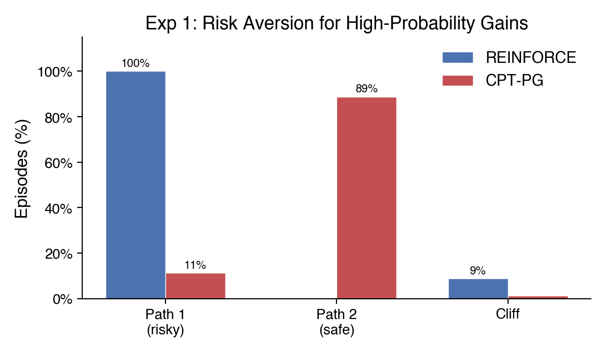
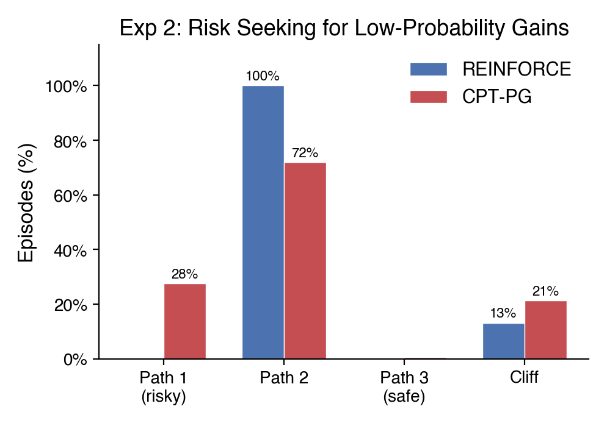
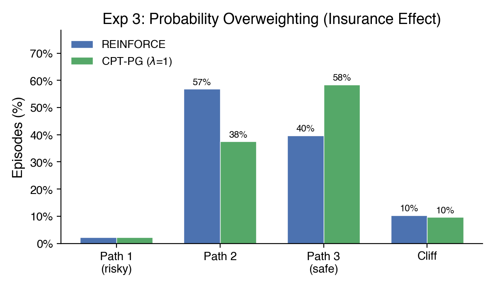
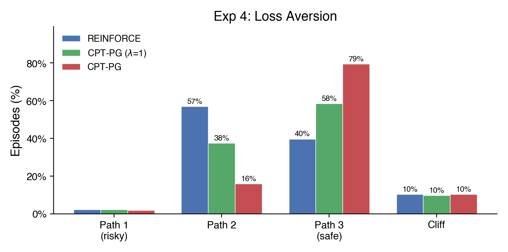

Current AI systems are undoublty able to make some decisions and perform some actions humans usually do. However how those decisions are made is likely pretty different. Language Models are trained with incredible large amounts of textual data, creating base models that are then aligned to perform as useful assistants with multiple methods like SFT, RLHF, RLVR. The ouptput is an assistant that is indeed useful and rational in most cases. Human decision making on the other side, while still largely a black box, has continuos demonstrations of irrationality and biases, with experiments replicating for different populations and decision making scenarios. 

In this post we compare the the decision making of some AI systems (Pure RL, LLM) with an approximation of the expected behavior of humans making decisions under risk. We will use a custom cliff walking environment to train and evaluate the agents. We will talk about the technical details on the next section, for this first one just try to put yourself in the position of the agent and imagine how you would make the decision.

---

## The Setup

You are an agent in a grid world. Your goal is to reach the target position on the other side. The bottom edge of the grid is a cliff, fall off and the episode ends. At each step, a random wind may push you one row downward toward the cliff. Higher rows are safer (farther from the edge) but require more steps, which can penalized. The central question: **which path do you choose?**

Each experiment configures rewards, wind strength, and grid size to create a different risk profile, isolating a specific aspect of how humans deviate from rational decision-making.

## Experiment 1: The Certainty Effect

<!-- Config: exp1_hp_gains | 5x5, step=0, goal=100, cliff=5, wind=0.05, gamma=0.90, ref=25 -->

Imagine you are offered two options:

- **Option A**: An 88% chance of winning \$500, with a 12% chance of getting just \$30.
- **Option B**: A 95% chance of winning \$400, with a 5% chance of getting \$30.

Option A has a higher expected payoff (\$443 vs \$381). A rational agent picks A. But most people pick B --- they prefer the near-certainty of a slightly lower reward over the risk of missing out. This is the *certainty effect*: when gains are probable, people become risk-averse.

In our grid world, the agent faces exactly this tradeoff. The risky path (closer to the cliff) reaches the goal in fewer steps, yielding a higher discounted reward, but has a ~12% chance of falling off. The safer path takes more steps but has a ~95% success rate.

::: {layout-ncol=2}
{group="exp1"}

{group="exp1"}
:::

CPT produces this risk aversion through two mechanisms working together. First, *diminishing sensitivity*: the value function $v(x) = x^{0.88}$ is concave for gains, so the marginal value of each additional dollar decreases --- the jump from \$400 to \$500 feels smaller than from \$0 to \$100. Second, *probability underweighting*: CPT's weighting function compresses high probabilities, so the 88% success chance on the risky path is perceived as lower than 88%. Together, these make the safer, more certain option feel disproportionately attractive.

**Result**: REINFORCE locks onto the riskiest path (Path1 = 100%). CPT-PG shifts decisively toward safety (Path2 = 89%, Path1 = 11%). Mann-Whitney *p* = 0.020, Cohen's *d* = 16.7, Cramer's *V* = 0.88.

{#fig-exp1}

## Experiment 2: The Lottery Ticket

<!-- Config: exp3_lp_gains | 7x7, step=-1, cliff=3, goal=100, wind=0.11, gamma=0.90, ref=40.75 -->

Now flip the scenario. Instead of probable gains, imagine a long-shot gamble:

- **Option A**: A safe route with a 93% chance of a moderate payoff.
- **Option B**: A risky route with only a 56% chance of reaching the goal --- but if you make it, the payoff is 56% higher.

A rational agent picks A (higher expected value). But humans buy lottery tickets. We overweight the small probability of a big win, making unlikely jackpots feel more probable than they are. This is the *lottery ticket effect*: when gains are improbable, people become risk-seeking.

In this 7x7 grid with a per-step cost of $-1$, the risky path (row 5, closest to the cliff) has a 44% chance of falling, but when it succeeds, its discounted return is 41 --- far higher than the safe path's 26. The safe path (row 4) succeeds 93% of the time but takes more steps through the wind. A rational agent picks the safe path for its higher expected value. But CPT overweights the 56% chance of the big payoff while diminishing sensitivity compresses the cliff penalty, making the gamble feel worth it.

::: {layout-ncol=2}
{group="exp2"}

{group="exp2"}
:::

**Result**: REINFORCE never takes the risky path (Path 1 = 0%, Path 2 = 100%). CPT-PG gambles on the risky path 28% of the time (Path 1 = 28%, Path 2 = 72%), accepting a higher cliff rate in pursuit of the bigger payoff. *t*-test *p* = 0.000001, Cohen's *d* = 4.04.

{#fig-exp2}

## Experiment 3: The Insurance Policy

<!-- Config: exp5_loss_aversion | 4x8, step=-1, goal=-1, cliff=-30, wind=0.10, gamma=0.98, ref=-20 -->
<!-- Comparison: REINFORCE vs CPT-PG(lambda=1.0) to isolate probability overweighting -->

Now imagine a different scenario. You are navigating a cost-minimizing route. Every step costs you, and falling off the cliff incurs a heavy penalty. The shortest path is riskiest but minimizes step costs. A rational agent weighs the savings against the cliff risk and picks the path with the lowest expected total cost.

But humans buy insurance. We pay a premium to avoid catastrophic outcomes, even when the expected value of the insurance is negative. We overweight the small probability of disaster --- a 10% chance of falling *feels* like more than 10%.

To isolate this effect, we compare REINFORCE against a CPT-PG agent with $\lambda = 1.0$ (no loss aversion), so the only active CPT mechanism is probability weighting. CPT's weighting function $w(p) = p^\gamma / (p^\gamma + (1-p)^\gamma)^{1/\gamma}$ inflates small probabilities: a 10% cliff risk on the moderate path gets overweighted, making it feel substantially more dangerous than it actually is.

::: {layout-ncol=2}
{group="exp3"}

{group="exp3"}
:::

**Result**: REINFORCE favors the moderately risky path (Path2 = 57%). CPT-PG with $\lambda = 1.0$ shifts toward the safest path (Path3 = 58%). Mann-Whitney *p* = 0.009, Cohen's *d* = 1.07.

{#fig-exp3}

## Experiment 4: Losses Loom Larger

<!-- Config: exp5_loss_aversion (same environment as Exp 3) -->
<!-- Comparison: CPT-PG(lambda=1.0) vs CPT-PG(lambda=2.25) to isolate loss aversion -->

Experiments 3 and 4 use the same environment but decompose two different CPT mechanisms. Here we test Kahneman and Tversky's most famous finding: **losses hurt roughly twice as much as equivalent gains feel good**.

With the reference point set at $-20$, outcomes split into gains and losses. Success returns (around $-10$ to $-12$) land above the reference and are perceived as gains. Cliff returns (around $-32$) fall below and are perceived as losses. With $\lambda = 1.0$, gains and losses are weighted equally. With $\lambda = 2.25$ (Tversky and Kahneman's empirical estimate), the cliff penalty is amplified --- a loss of $12$ below the reference *feels* like a loss of $27$.

::: {layout-ncol=3}
{group="exp4"}

{group="exp4"}

{group="exp4"}
:::

**Result**: CPT-PG with $\lambda = 1.0$ already shifts toward safety due to probability overweighting (Path3 = 58%). Adding loss aversion with $\lambda = 2.25$ amplifies the shift dramatically (Path3 = 79%). CPT($\lambda$=1.0) vs CPT($\lambda$=2.25): *p* = 0.005, *d* = 1.18. Full CPT vs REINFORCE: *p* = 7.4 $\times$ 10^-6^, *d* = 2.38.

{#fig-exp4}

## How It Works

### The Grid World

The environment is a resizable grid world built on Gymnasium's CliffWalking. The agent starts at the bottom-left and must reach the bottom-right (the goal). The bottom row is the cliff: falling off ends the episode with a configurable penalty. Wind is a stochastic perturbation --- at each step, with probability `wind_prob`, the agent's action is replaced with a downward push toward the cliff. Higher rows are safer but require more steps to traverse. Rewards for stepping, reaching the goal, and falling off the cliff are all independently configurable, letting us construct pure gains domains (positive goal, zero step cost), pure losses domains (negative step cost, negative cliff penalty), and mixed domains.

### REINFORCE: The Rational Agent

REINFORCE is a Monte Carlo policy gradient algorithm. The agent runs complete episodes, computes discounted returns $G_t = \sum_{k=0}^{T-t} \gamma^k r_{t+k}$, and updates its policy by ascending the gradient $\nabla_\theta J = \mathbb{E}\left[\sum_t (G_t - b) \nabla_\theta \log \pi_\theta(a_t|s_t)\right]$. An exponential moving average baseline $b$ reduces variance. Entropy regularization encourages exploration early and is annealed down during training. The policy network is a two-layer MLP mapping one-hot state encodings to action probabilities. This is the "rational" agent: it converges to the policy that maximizes expected discounted return.

### Cumulative Prospect Theory

Cumulative Prospect Theory models four systematic deviations from rational choice:

1. **Diminishing sensitivity**: The value function is concave for gains and convex for losses ($v(x) = x^\alpha$ for $x \geq 0$, $v(x) = -\lambda|x|^\beta$ for $x < 0$), so each additional dollar matters less.
2. **Loss aversion**: Losses are amplified by $\lambda \approx 2.25$, so losing \$100 feels as painful as gaining \$225 feels good.
3. **Probability weighting**: Small probabilities are overweighted and large probabilities are underweighted via $w(p) = p^\gamma / (p^\gamma + (1-p)^\gamma)^{1/\gamma}$.
4. **Reference dependence**: Outcomes are evaluated as gains or losses relative to a reference point, not in absolute terms.

These four components predict a "fourfold pattern" of risk attitudes: risk-averse for likely gains (Experiment 1), risk-seeking for unlikely gains (Experiment 2), risk-averse for unlikely losses (Experiment 3), and increasingly risk-averse when losses are amplified by loss aversion (Experiment 4).

### CPT-PG: Making REINFORCE Human

CPT-PG ([Lepel & Barakat, 2024](https://arxiv.org/abs/2410.02605)) replaces REINFORCE's raw returns with CPT-distorted weights $\hat{\varphi}$ computed from the batch of trajectories. For each episode $i$, the algorithm computes the discounted return $R_i$, applies the CPT value function to split it into gains $u^+$ and losses $u^-$ relative to the reference point, then integrates against the probability-weighted empirical survival function to obtain $\hat{\varphi}(R_i)$. This scalar replaces $G_t - b$ in the policy gradient. The `center_phi` normalization subtracts the batch mean $\hat{\varphi}$ to ensure the CPT-induced preference ordering is preserved even in pure domains where all $\hat{\varphi}$ values would otherwise have the same sign.

All experiments use Tversky and Kahneman's original parameter estimates: $\alpha = \beta = 0.88$, $\lambda = 2.25$, $\gamma^+ = 0.61$, $\gamma^- = 0.69$.

## Conclusions

Four experiments, four CPT mechanisms, four predicted behavioral shifts --- all confirmed. The standard REINFORCE agent behaves as expected value theory predicts, always converging to the policy with the highest expected return. The CPT-PG agent, equipped with the same neural network and training procedure but distorted by human-like biases, systematically deviates in the exact directions that Cumulative Prospect Theory predicts.

These results suggest that prospect theory's biases are not merely descriptive labels but *functional specifications* that can be engineered into artificial agents. The CPT-PG algorithm provides a principled way to build agents whose risk preferences match human behavioral patterns, which could be valuable for human-AI collaboration, preference alignment, or modeling human decision-making in economic simulations.

The code for all experiments is available at [TODO: repository link].

## References

- Tversky, A., & Kahneman, D. (1992). Advances in prospect theory: Cumulative representation of uncertainty. *Journal of Risk and Uncertainty*, 5(4), 297-323.
- Kahneman, D., & Tversky, A. (1979). Prospect theory: An analysis of decision under risk. *Econometrica*, 47(2), 263-292.
- Lepel, T., & Barakat, A. (2024). CPT-PG: Cumulative Prospect Theory in Policy Gradient. *arXiv:2410.02605*.
- Williams, R. J. (1992). Simple statistical gradient-following algorithms for connectionist reinforcement learning. *Machine Learning*, 8(3), 229-256.
