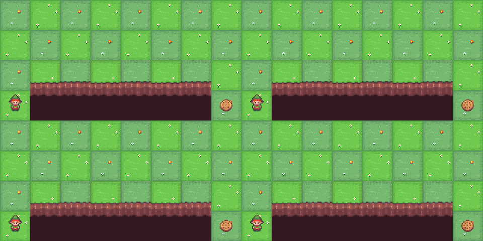
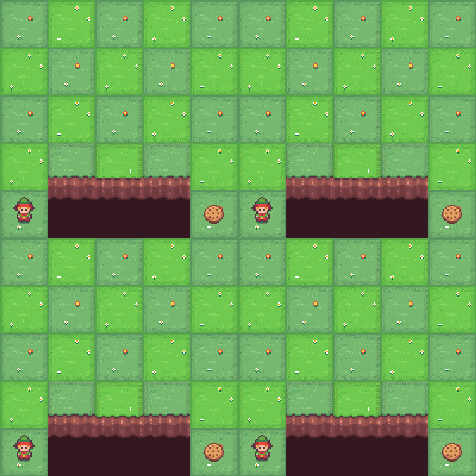
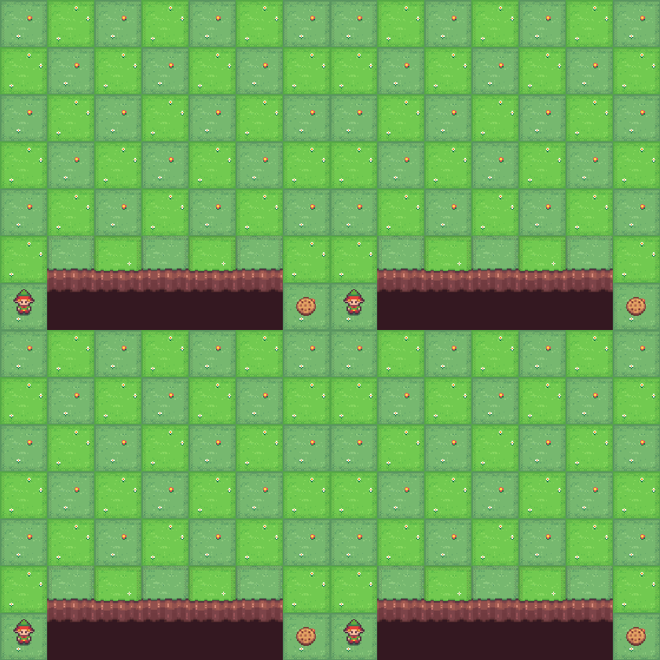
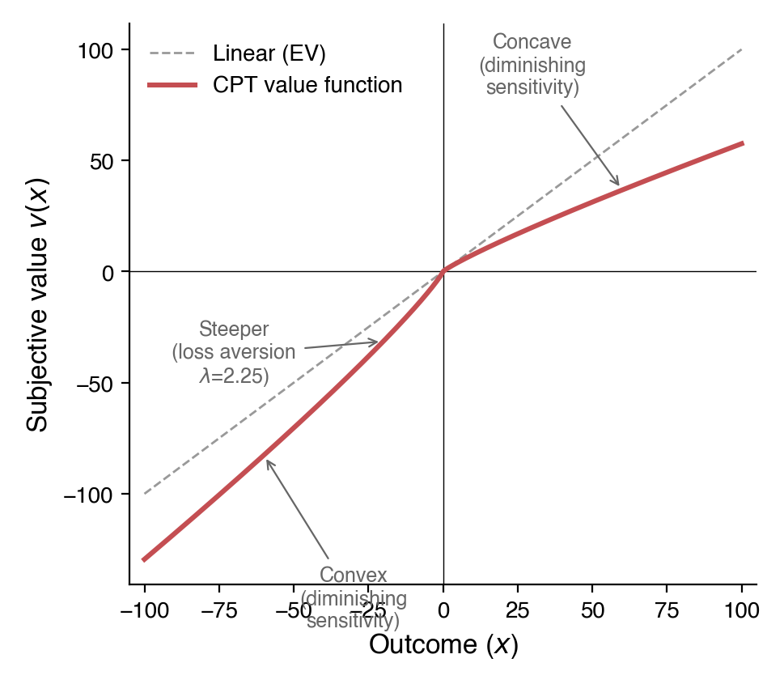
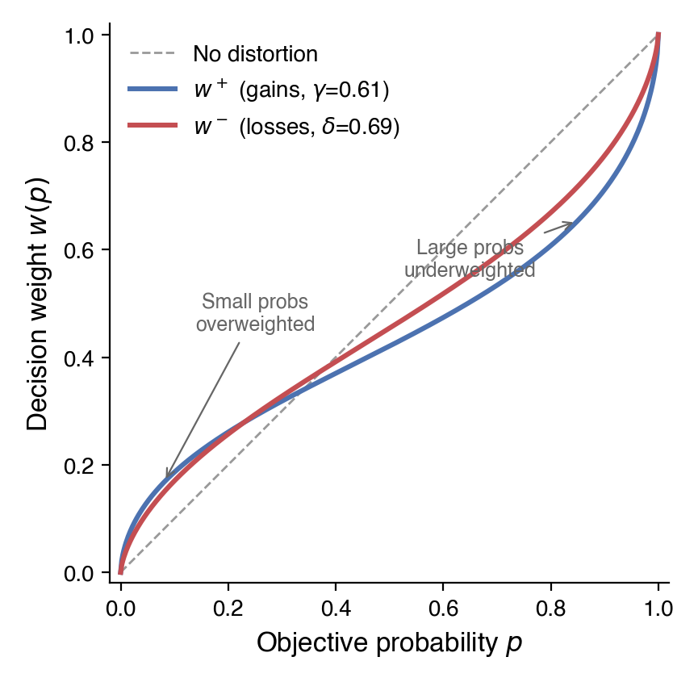

Current AI systems are undoubtedly making decisions and performing actions that humans usually do. How those decisions are made is likely to be pretty different though. Reinforcement Learning models are usually trained to maximize an expected return, while Language Models are trained with large amounts of digital data and then aligned to perform as useful assistants with methods like SFT, RLHF, and RLVR. The result is an assistant that is indeed useful and rational, in most cases. Human decision making on the other hand, while still largely a black box, has common demonstrations of irrationality and biases, with experiments replicating the results for multiple populations and decision making scenarios. 

In this post we compare the decision making of raw AI agents (REINFORCE, LLM), with an agent aligned to average expected human behavior under risk (CPT-PG). We will talk about the technical details in the next section, for now just try to put yourself in the position of the agent and imagine how you would make the decision.

## The Setup

You are controlling an agent in a grid world. Your goal is to reach the target position on the other side. The bottom edge of the grid is a cliff, falling off ends the episode. At each step, a random wind may push you one row downward toward the cliff. Higher rows are safer (farther from the edge) but require more steps, which can be penalized. The central question: **which path do you choose?**

## Experiment 1: The Insurance Policy

{fig-align="center"}

4x8 grid. Everything costs you: each step −1, reaching the goal −1, falling off the cliff −30, and moderate wind (10% chance each step). **Which path would you take?**

::: {layout-ncol=3}
{group="exp3"}

{group="exp3"}

{group="exp3"}
:::

REINFORCE finds the middle ground, a moderate path balances step costs against cliff risk. CPT-PG with no risk aversion overweights the small cliff probability: the *insurance effect*: the rare catastrophe *feels* more dangerous than it is, pushing the agent to safety. Turn up loss aversion ($\lambda = 2.25$) and the shift grows: a loss now *feels* more than twice as bad as an equivalent gain feels good, making even small risks intolerable. The LLM lands between the two CPT variants, taking the safest path 70% of the time.

## Experiment 2: The Certainty Effect

{fig-align="center"}

5x5 grid. Reaching the goal pays +100, falling off the cliff gives only +5. Light wind (5% chance each step). Each extra step reduces your final reward by 10% through discounting (γ = 0.90). **Which path would you take?**

::: {layout-ncol=3}
{group="exp1"}

{group="exp1"}

{group="exp1"}
:::

REINFORCE takes the risky shortcut every time, it's the highest expected reward. CPT-PG plays it safe. The reference point turns the small cliff consolation prize into a perceived loss. This, in addition to the overweighting of the fall probability, makes cliff outcomes feel devastating in CPT terms, pushing the agent away from the riskier path where cliff falls are more frequent.

## Experiment 3: The Gamble

{fig-align="center"}

7x7 grid. Each step costs −1 and future rewards are discounted by 10% per step (γ = 0.90), reaching the goal pays +100, falling gives only +3 (forfeiting the much larger goal reward). Strong wind (11%). **Which path would you take?**

::: {layout-ncol=3}
{group="exp2"}

{group="exp2"}

{group="exp2"}
:::

REINFORCE always plays safe, the expected value says don't gamble. CPT-PG takes the risky path 28% of the time. In CPT, outcomes aren't evaluated in absolute terms, they're measured against a reference point. When the reference point is set near the risky path's best-case return, the safe path's guaranteed reward feels like accepting a moderate loss rather than locking in a win. The risky path offers a shot at breaking even. This is reference dependence: the same objective payoff feels very different depending on what you compare it to. With the reference point selected, the agent takes more risks on average.

## How It Works

### The Grid World

Our environment is a resizable grid world built on top of Gymnasium's CliffWalking. The agent starts at the bottom-left and must reach the bottom-right (the goal). The bottom row is the cliff: falling off ends the episode with a configurable penalty. Wind is a stochastic perturbation --- at each step, with probability `wind_prob`, the agent's action is replaced with a downward push toward the cliff. Higher rows are safer but require more steps to traverse. Rewards for stepping, reaching the goal, and falling off the cliff are all independently configurable, letting us construct pure gains domains (positive goal, zero step cost), pure losses domains (negative step cost, negative cliff penalty), and mixed domains.

### REINFORCE: The Rational Agent

REINFORCE is a Monte Carlo policy gradient algorithm. The agent runs complete episodes, computes discounted returns $G_t = \sum_{k=0}^{T-t} \gamma^k r_{t+k}$, and updates its policy by ascending the gradient $\nabla_\theta J = \mathbb{E}\left[\sum_t (G_t - b) \nabla_\theta \log \pi_\theta(a_t|s_t)\right]$. An exponential moving average baseline $b$ reduces variance. Entropy regularization encourages exploration early and is annealed down during training. The policy network is a two-layer MLP mapping one-hot state encodings to action probabilities. This is the "rational" agent: it converges to the policy that maximizes expected discounted return.

### Cumulative Prospect Theory

Cumulative Prospect Theory models four systematic deviations from rational choice:

1. **Diminishing sensitivity**: The value function is concave for gains and convex for losses ($v(x) = x^\alpha$ for $x \geq 0$, $v(x) = -\lambda|x|^\beta$ for $x < 0$), so each additional dollar matters less.
2. **Loss aversion**: Losses are amplified by $\lambda \approx 2.25$, so losing \$100 feels as painful as gaining roughly \$260 feels good.
3. **Probability weighting**: Small probabilities are overweighted and large probabilities are underweighted via $w(p) = p^\delta / (p^\delta + (1-p)^\delta)^{1/\delta}$ (where $\delta$ is distinct from the RL discount factor $\gamma$).
4. **Reference dependence**: Outcomes are evaluated as gains or losses relative to a reference point, not in absolute terms.

::: {layout-ncol=2}
{#fig-cpt-value}

{#fig-cpt-prob}
:::

These four components predict a specific pattern of risk attitudes: risk-averse for likely gains, risk-seeking for likely losses, and risk-averse for unlikely losses, amplified further by loss aversion. Though individual behavior may vary, the patterns are consistent across populations and have replicated in experiments over the years.

### CPT-PG: Combining Cumulative Prospect Theory ideas with Policy Gradient learning methods

CPT-PG ([Lepel & Barakat, 2024](https://arxiv.org/abs/2410.02605)) replaces REINFORCE's raw returns with CPT-distorted weights $\hat{\varphi}$ computed from the batch of trajectories. For each episode $i$, the algorithm computes the discounted return $R_i$, applies the CPT value function to split it into gains $u^+$ and losses $u^-$ relative to the reference point, then integrates against the probability-weighted empirical survival function to obtain $\hat{\varphi}(R_i)$. This scalar replaces $G_t - b$ in the policy gradient. Our experiments use Tversky and Kahneman's original parameter estimates: $\alpha = \beta = 0.88$, $\lambda = 2.25$, $\delta^+ = 0.61$, $\delta^- = 0.69$.

### Technical challenges

Adapting the CPT risk framework to Reinforcement Learning remains challenging, despite progress by Lepel & Barakat (2024) and others, mainly because the original CPT theory was developed for evaluation of complete outcomes, while RL learns on a per-step basis. Some of the main challenges during the process were:

* The value function in CPT is not additive, which limits our ability to use the Bellman equation and other RL techniques.
* The probability distortions require us to know (or approximate) the explicit outcome distribution, which requires additional work and unstable approximations.
* In CPT-PG we broadcast the CPT-distorted return to all steps in the episode, making it harder to learn and blurring the credit assignment for important decisions.
* It's not always clear how multiple factors in sequential decision making and learning scenarios interact and what the final risk attitude will be.
* Most of the experiments we wanted to run required changes to the original cliff walking environment, including adding wind, changing the reward structure, and the grid size. The discount factor was specially important in positive domains.

### Results

The three experiments show significant behavioral shifts in the directions predicted by CPT. Each agent was trained across 4–16 seeds and evaluated over 20 episodes per seed. All pairwise comparisons between REINFORCE and CPT-PG were statistically significant (p < 0.05, with most at p < 0.005) with large effect sizes (Cohen's d > 1.1).

**Experiment 1 - The Insurance Policy**: REINFORCE favors the moderate path (Path 2 = 57%). CPT-PG with $\lambda = 1.0$ shifts toward the safest path (Path 3 = 58%). Adding loss aversion ($\lambda = 2.25$) amplifies the shift dramatically (Path 3 = 79%).

{#fig-exp1a}

{#fig-exp1b}

**Experiment 2 - The Certainty Effect**: REINFORCE locks onto the riskiest path (Path 1 = 100%). CPT-PG shifts toward safety (Path 2 = 89%).

{#fig-exp2}

**Experiment 3 - The Gamble**: REINFORCE always plays safe (Path 2 = 100%). CPT-PG gambles on the risky path 28% of the time (Path 1 = 28%, Path 2 = 72%).

{#fig-exp3}

## Conclusions

AI agents learn and behave in a different way than humans, which is likely to generate divergences in some of the decisions they make. Even large post-trained language models are aligned to be useful assistants, which differs from humans' expected behavior and goals. In these experiments we can see a few examples of how those differences manifest themselves in toy risk environments. It's pretty plausible that these are also manifesting in more diffuse and important decisions every day, which is why this is an important topic to explore.

However, the limited scope of Cumulative Prospect Theory, and the challenges of adapting it to Reinforcement Learning, may not make it the best fit at the moment to map AI decision making to human expected behavior. Other interesting work like [Persona Generators (Paglieri et al., 2026)](https://arxiv.org/abs/2602.03545) and [Experiential Reinforcement Learning (Shi et al., 2026)](https://arxiv.org/abs/2602.13949) is definitely worth exploring.

The code for all experiments is available at [ai-behavior-under-risk](https://github.com/santiagomvc/ai-behavior-under-risk).

## References

- Tversky, A., & Kahneman, D. (1992). Advances in prospect theory: Cumulative representation of uncertainty. *Journal of Risk and Uncertainty*, 5(4), 297-323.
- Kahneman, D., & Tversky, A. (1979). Prospect theory: An analysis of decision under risk. *Econometrica*, 47(2), 263-292.
- Lepel, T., & Barakat, A. (2024). CPT-PG: Cumulative Prospect Theory in Policy Gradient. *arXiv:2410.02605*.
- Williams, R. J. (1992). Simple statistical gradient-following algorithms for connectionist reinforcement learning. *Machine Learning*, 8(3), 229-256.
